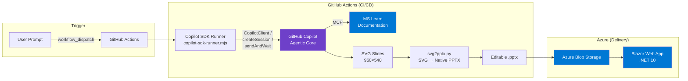
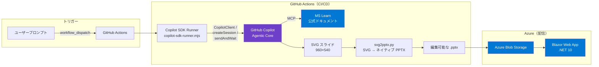

# Copilot Slide Agent

> **🇯🇵 [日本語版はこちら / Japanese Version](#日本語版--japanese-version)**

**One prompt → 10 minutes → Visually rich, editable PPTX with diagrams.**

An agent powered by the GitHub Copilot SDK that generates **visually rich, diagram-rich, fully editable PowerPoint slides** from a single natural-language prompt.  
Reduces technical slide creation from **2–3 hours to ~10 minutes**.

---

## Why

| Before | After |
|--------|-------|
| Manually search MS Learn for product info | Copilot auto-queries official docs via MS Learn MCP |
| Build PowerPoint slides from scratch | SVG → native PPTX auto-conversion (fully editable text) |
| 2–3 hours per deck | One prompt → ~10 minutes |
| Inconsistent quality across decks | Skill definitions enforce design & structure rules |

---

## Slide Examples

Sample slides generated by this agent (SVG → auto-converted to editable PPTX):


---

## Architecture



1. User enters a natural-language prompt (Web UI or GitHub Actions `workflow_dispatch`)
2. **Copilot SDK** (`@github/copilot-sdk`) starts an agent session
3. Copilot queries the **MS Learn MCP server** for official documentation → generates **SVG slides** (960×540)
4. `svg2pptx.py` converts SVG elements to **native PowerPoint objects** (shapes, text boxes, styled paragraphs — not images)
5. Generated `.pptx` is uploaded to Azure Blob Storage → accessible via Blazor web app

---

## Quick Start

### Via GitHub Actions (Recommended)

1. Go to **Actions** tab → **Copilot SDK Runner** → **Run workflow**
2. Enter a prompt (e.g., `Create a PPTX overview of Azure Cosmos DB`)
3. Select a model (`claude-opus-4.6` recommended)
4. Download the generated `.pptx` from workflow artifacts

### Local Execution

```bash
git clone https://github.com/kanazawazawa/copilot-agent-workspace.git
cd copilot-agent-workspace

pip install -r scripts/requirements.txt

export COPILOT_GITHUB_TOKEN="ghp_xxx"
export COPILOT_PROMPT="Create a PPTX overview of Azure App Service"
node scripts/copilot-sdk-runner.mjs
```

### Prerequisites

- GitHub Copilot Enterprise / Business license
- Fine-grained PAT with `Copilot Requests` permission
- Node.js 22+ (`@github/copilot-sdk` requires `node:sqlite`)
- Python 3.10+ / `python-pptx` / `lxml`
- Azure subscription (optional — for Blob Storage + Web App)

---

## SDK Features Used

| SDK Feature | Usage |
|-------------|-------|
| `CopilotClient` | Client initialization with auto token detection |
| `createSession` | Session creation with model selection (claude-opus-4.6 / gpt-5.2 / o3) |
| `sendAndWait` | Synchronous prompt execution with configurable timeout |
| `onPermissionRequest` | Automated tool permission approval |
| **Retry control** | Configurable via `COPILOT_MAX_RETRIES` / `COPILOT_RETRY_DELAY` |
| **Timeout control** | `COPILOT_TIMEOUT_MS` (default: 10 min) |

> SDK Runner source: [`scripts/copilot-sdk-runner.mjs`](scripts/copilot-sdk-runner.mjs)

---

## Key Design Decisions

| Decision | Rationale |
|----------|-----------|
| **SVG as intermediate format** | AI excels at markup generation. SVG is a standard text format Copilot handles natively. |
| **Native PPTX objects (not images)** | `svg2pptx.py` converts to `add_shape()` / `add_textbox()` / `text_frame`. Fully editable & searchable in PowerPoint. |
| **Separation of AI and conversion** | AI focuses on content (SVG). Conversion is deterministic Python — zero hallucination risk in the conversion step. |
| **CLI → SDK migration** | Programmatic control: retry, timeout, permission management, structured error handling. |

---

## Environment Variables

| Variable | Default | Description |
|----------|---------|-------------|
| `COPILOT_GITHUB_TOKEN` | (required) | GitHub PAT with Copilot permission |
| `COPILOT_PROMPT` | (required) | Natural-language prompt |
| `COPILOT_MODEL` | `claude-opus-4.6` | AI model to use |
| `COPILOT_MAX_RETRIES` | `2` | Max attempts (1 = no retry) |
| `COPILOT_RETRY_DELAY` | `10` | Seconds between retries |
| `COPILOT_TIMEOUT_MS` | `600000` | Timeout in ms (default: 10 min) |

---

## Agent Configuration

Files that control Copilot's behavior:

| File | Purpose |
|------|---------|
| [`AGENTS.md`](AGENTS.md) | Project-wide agent policy and workflow |
| [`.github/copilot-instructions.md`](.github/copilot-instructions.md) | Language, style, and output rules |
| `.github/skills/` | Domain knowledge packages (MS Learn research, slide design, docs, customer research) |
| `.github/instructions/` | File-pattern-specific quality standards (auto-applied via `applyTo`) |
| [`.vscode/mcp.json`](.vscode/mcp.json) | MCP server config (MS Learn, context7, memory, etc. — 6 servers) |

---

## Azure Integration

| Service | Usage |
|---------|-------|
| **Azure Blob Storage** | Storage and delivery of generated PPTX files |
| **Azure App Service** | Hosting for the Blazor Server web app (file distribution UI) |

The web app (`webapp/`) provides prompt input, job tracking, and PPTX browsing/download as a **file distribution interface**.

---

## Responsible AI

- Generated content is based on **official MS Learn documentation via MCP** — not unverified sources
- Generated slides require **human review** before customer-facing use
- **No customer data** is processed, stored, or transmitted
- Tool permissions use an all-allow policy (scope restriction recommended for production)
- PAT uses minimal permissions (`Copilot Requests` only)

---

## Project Structure

```
├── .github/
│   ├── copilot-instructions.md      # Copilot shared rules
│   ├── workflows/copilot-poc.yml    # CI/CD pipeline
│   ├── skills/                      # 4 domain knowledge skills
│   └── instructions/                # File-pattern-specific rules
├── scripts/
│   ├── copilot-sdk-runner.mjs       # SDK-based Copilot runner (with retry)
│   ├── svg2pptx.py                  # SVG → native PPTX converter (1,093 lines)
│   └── requirements.txt
├── webapp/                          # Blazor Server file distribution UI (.NET 10)
├── presentations/                   # Project intro slides
├── output/                          # Generated artifacts (.gitignore)
├── AGENTS.md                        # Agent policy & workspace design
├── .vscode/mcp.json                 # MCP server config (6 servers)
└── README.md                        # ← This file
```

---

## Tech Stack

| Category | Technology |
|----------|-----------|
| SDK | `@github/copilot-sdk` (Node.js 22+) |
| Slide Conversion | `python-pptx` / `lxml` (SVG → native PPTX) |
| CI/CD | GitHub Actions (`workflow_dispatch`) |
| Web App | Blazor Server / .NET 10 / Octokit 14 |
| Storage | Azure Blob Storage / Azure App Service |
| MCP | microsoft-docs, context7, memory, github, etc. |

---

## License

MIT

---

# 日本語版 / Japanese Version

**プロンプト1つ → 10分 → デザイン性が高く図表入りの編集可能な PPTX を自動生成**

GitHub Copilot SDK を使い、自然言語プロンプトから **デザイン性が高く図表入りの編集可能な PowerPoint スライド** を自動生成するエージェントです。  
顧客向け技術スライドの作成にかかる **2〜3 時間の作業を約 10 分** に短縮します。

---

### なぜ作ったか

| Before | After |
|--------|-------|
| MS Learn を手動で検索 | Copilot が MCP 経由で公式ドキュメントを自動取得 |
| PowerPoint でゼロからスライドを構築 | SVG → ネイティブ PPTX に自動変換（テキスト編集可能） |
| 1 デッキに 2〜3 時間 | プロンプト入力 → 約 10 分で完成 |
| 品質にばらつき | スキル定義でデザイン・構成ルールを統一 |

---

### スライド例


---

### アーキテクチャ



1. ユーザーが自然言語プロンプトを入力（Web UI or GitHub Actions 手動実行）
2. **Copilot SDK**（`@github/copilot-sdk`）がエージェントセッションを開始
3. Copilot が **MS Learn MCP サーバー** で公式ドキュメントを調査 → **SVG スライド** を生成
4. `svg2pptx.py` が SVG 要素を **ネイティブ PowerPoint オブジェクト** に変換（図形・テキストボックス — 画像埋め込みではない）
5. 生成された `.pptx` を Azure Blob Storage にアップロード → Web アプリで配布

---

### SDK で使用している機能

| SDK Feature | 用途 |
|-------------|------|
| `CopilotClient` | SDK クライアント初期化（自動トークン検出） |
| `createSession` | モデル選択付きセッション作成（claude-opus-4.6 / gpt-5.2 / o3 等） |
| `sendAndWait` | タイムアウト付き同期プロンプト実行 |
| `onPermissionRequest` | ツール使用許可の自動承認 |
| **リトライ制御** | `COPILOT_MAX_RETRIES` / `COPILOT_RETRY_DELAY` で設定可能なリトライ |
| **タイムアウト制御** | `COPILOT_TIMEOUT_MS`（デフォルト 10 分） |

> SDK Runner のコード: [`scripts/copilot-sdk-runner.mjs`](scripts/copilot-sdk-runner.mjs)

---

### 主要な技術判断

| 判断 | 理由 |
|------|------|
| **中間形式として SVG** | AI はマークアップ生成が得意。SVG は標準テキスト形式で Copilot がネイティブに扱える |
| **画像ではなくネイティブ PPTX オブジェクト** | `svg2pptx.py` が `add_shape()` / `add_textbox()` / `text_frame` に変換。PowerPoint で完全に編集・検索可能 |
| **AI と変換の分離** | AI はコンテンツ（SVG）に集中。変換は決定論的 Python コードで行い、ハルシネーションリスクを排除 |
| **CLI → SDK 移行** | プログラム的制御（リトライ・タイムアウト・パーミッション管理・構造化エラーハンドリング） |

---

### クイックスタート

#### GitHub Actions で実行（推奨）

1. **Actions** タブ → **Copilot SDK Runner** → **Run workflow**
2. プロンプトを入力（例: `Azure Cosmos DB の概要をPPTXで作成してください`）
3. モデルを選択（`claude-opus-4.6` 推奨）
4. 完了後、Artifact から `.pptx` をダウンロード

#### ローカル実行

```bash
git clone https://github.com/kanazawazawa/copilot-agent-workspace.git
cd copilot-agent-workspace
pip install -r scripts/requirements.txt

export COPILOT_GITHUB_TOKEN="ghp_xxx"
export COPILOT_PROMPT="Azure Cosmos DB の概要をPPTXで作成してください"
node scripts/copilot-sdk-runner.mjs
```

#### 前提条件

- GitHub Copilot Enterprise / Business ライセンス
- Fine-grained PAT（`Copilot Requests` パーミッション）
- Node.js 22+（`@github/copilot-sdk` が `node:sqlite` を使用）
- Python 3.10+ / `python-pptx` / `lxml`
- Azure サブスクリプション（任意 — Blob Storage + Web App 用）

---

### 環境変数

| 変数名 | デフォルト値 | 説明 |
|--------|-------------|------|
| `COPILOT_GITHUB_TOKEN` | （必須） | Copilot パーミッション付き GitHub PAT |
| `COPILOT_PROMPT` | （必須） | 自然言語プロンプト |
| `COPILOT_MODEL` | `claude-opus-4.6` | 使用する AI モデル |
| `COPILOT_MAX_RETRIES` | `2` | 最大試行回数（1 = リトライなし） |
| `COPILOT_RETRY_DELAY` | `10` | リトライ間の秒数 |
| `COPILOT_TIMEOUT_MS` | `600000` | sendAndWait のタイムアウト（ミリ秒） |

---

### エージェント構成

| ファイル | 役割 |
|---------|------|
| [`AGENTS.md`](AGENTS.md) | プロジェクト全体の方針・ワークフロー定義 |
| [`.github/copilot-instructions.md`](.github/copilot-instructions.md) | Copilot の言語・スタイル・出力ルール |
| `.github/skills/` | タスク別の専門知識パッケージ（MS Learn 調査、スライド設計、ドキュメント作成、顧客調査） |
| `.github/instructions/` | ファイルパターン別の品質基準（`applyTo` で自動適用） |
| [`.vscode/mcp.json`](.vscode/mcp.json) | MCP サーバー設定（MS Learn、context7、memory 等 6 サーバー） |

---

### Azure 連携

| サービス | 用途 |
|----------|------|
| **Azure Blob Storage** | 生成済み PPTX ファイルの保管・配信 |
| **Azure App Service** | Blazor Server Web アプリのホスティング（ファイル配布 UI） |

Web アプリ（`webapp/`）はプロンプト入力・ジョブ管理・PPTX の閲覧/ダウンロードを提供する **ファイル配布インターフェース** です。

---

### Responsible AI

- 生成コンテンツは **MS Learn MCP 経由の公式ドキュメント** に基づく（未検証ソースではない）
- 生成スライドは顧客提示前に **人間レビュー** が必要
- 顧客データの処理・保存・送信は **一切行わない**
- ツール使用許可は現在 all-allow ポリシー（本番ではスコープ限定が必要）
- PAT は最小権限（`Copilot Requests` のみ）
