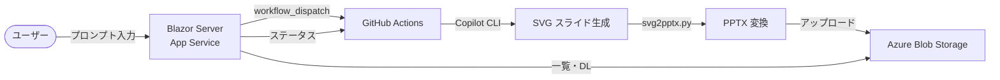

# Copilot Agent Workspace

## この環境について

GitHub Copilot を **調査アシスタント & ドキュメント作成パートナー** として活用するためのエージェント環境です。Web UI からプロンプトを入力すると、GitHub Actions 上で Copilot CLI が実行され、PPTX スライドが自動生成されます。

- **Web アプリ**: Blazor Server (.NET 10) — プロンプト入力・ジョブ管理・履歴閲覧
- **バックエンド**: GitHub Actions + Copilot CLI — SVG スライド生成 → PPTX 変換
- **ストレージ**: Azure Blob Storage — 生成済み PPTX の保管・配信
- **ホスティング**: Azure App Service（`app-20260304.azurewebsites.net`）

[microsoft/skills](https://github.com/microsoft/skills) や [github/awesome-copilot](https://github.com/github/awesome-copilot) のパターンを参考に構築しています。

---

## ディレクトリ構成

```
ghcpskills/
├── .github/
│   ├── copilot-instructions.md              # Copilot 共通ルール（常に適用）
│   ├── workflows/
│   │   └── copilot-poc.yml                  # Copilot CLI 実行ワークフロー
│   ├── skills/                              # タスク別の専門知識
│   │   ├── ms-learn-research/SKILL.md       # MS Learn 調査
│   │   ├── customer-research/SKILL.md       # 顧客情報調査
│   │   ├── slide-creator/SKILL.md           # SVGスライド→PPTX変換
│   │   └── document-writer/SKILL.md         # Markdown ドキュメント作成
│   ├── instructions/                        # ファイルパターン別ルール
│   │   ├── markdown-quality.instructions.md # *.md 向け
│   │   └── research-quality.instructions.md # 調査ドキュメント向け
│   └── prompts/                             # 再利用可能なプロンプト
│       └── aca-network-research.prompt.md
├── webapp/                                  # Blazor Server Web アプリ
│   ├── Components/Pages/
│   │   ├── Home.razor                       # トップ（プロンプト入力・作成履歴）
│   │   ├── Jobs.razor                       # ジョブ一覧（GitHub Actions 実行状況）
│   │   └── History.razor                    # PPTX 履歴（カード表示・検索）
│   ├── Services/
│   │   ├── GitHubActionsService.cs          # GitHub Actions API 連携
│   │   └── BlobStorageService.cs            # Azure Blob Storage 連携
│   ├── CopilotWebApp.csproj                 # .NET 10 / Octokit 14 / Azure.Storage.Blobs
│   └── Program.cs
├── scripts/
│   └── svg2pptx.py                          # SVG→PPTX 変換スクリプト
├── output/                                  # 成果物の出力先
│   ├── research/                            #   調査結果
│   ├── documents/                           #   提案書・報告書
│   ├── slides/                              #   SVG スライド + PPTX
│   └── customers/                           #   顧客調査
├── .vscode/
│   └── mcp.json                             # MCP サーバー設定
├── AGENTS.md                                # 全体方針・原則（常に適用）
├── LICENSE                                  # MIT License
└── README.md                                # ← このファイル
```

---

## アーキテクチャ



上記のフローの概要を以下に示す。

1. ユーザーが Web UI でプロンプトを入力して実行
2. Blazor Server が GitHub Actions の `workflow_dispatch` をトリガー
3. GitHub Actions 上で Copilot CLI が SVG スライドを生成
4. `svg2pptx.py` で PPTX に変換し、Azure Blob Storage にアップロード
5. Web UI から履歴の閲覧・ダウンロードが可能

---

## Web アプリの機能

| ページ | 機能 |
|--------|------|
| Home (`/`) | プロンプト入力、テンプレート選択、作成履歴テーブル（実行中ジョブ表示付き） |
| Jobs (`/jobs`) | GitHub Actions 実行一覧、自動更新、Blob ファイル詳細 |
| History (`/history`) | PPTX カード表示、キーワード検索・絞り込み、ダウンロード |

---

## 各ファイルの役割と使い分け

### AGENTS.md（プロジェクト全体の方針）

- **いつ効くか:** Copilot のすべてのインタラクション
- **何を書くか:** このプロジェクト固有の原則、ワークフロー、禁止事項
- **元ネタ:** [microsoft/skills の Agents.md](https://github.com/microsoft/skills/blob/main/Agents.md)

### .github/copilot-instructions.md（Copilot 共通ルール）

- **いつ効くか:** このワークスペースで Copilot を使うとき常に
- **何を書くか:** 言語設定、回答スタイル、共通フォーマット
- **違い:** AGENTS.md がプロジェクト固有なのに対し、こちらは Copilot の振る舞いルール

### .github/skills/（スキル）

- **いつ効くか:** 関連するタスクをリクエストしたとき（トリガーワードで発動）
- **何を書くか:** 特定タスクの手順、テンプレート、ルール
- **元ネタ:** [microsoft/skills のスキル構造](https://github.com/microsoft/skills/tree/main/.github/skills)、[awesome-copilot の skills/](https://github.com/github/awesome-copilot/tree/main/skills)

### .github/instructions/（インストラクション）

- **いつ効くか:** `applyTo` で指定したファイルパターンの編集時に自動適用
- **何を書くか:** そのファイル種別固有のルール・品質基準

### .github/workflows/copilot-poc.yml（GitHub Actions ワークフロー）

- **いつ効くか:** Web UI から実行ボタンを押したとき、または手動 dispatch 時
- **何をするか:** Copilot CLI で SVG 生成 → PPTX 変換 → Blob Storage にアップロード

### .vscode/mcp.json（MCP サーバー設定）

- **いつ効くか:** Copilot がツールとして使える外部サービスの設定
- **何を書くか:** MCP サーバーの接続情報

---

## 設定済み MCP サーバー

| サーバー | 用途 | 種類 |
|----------|------|------|
| `microsoft-docs` | MS Learn 公式ドキュメント検索・取得 | HTTP |
| `context7` | ドキュメントのセマンティック検索 | stdio |
| `deepwiki` | GitHub リポジトリの質問応答 | HTTP |
| `sequentialthinking` | 複雑な問題の段階的推論 | stdio |
| `memory` | セッション間の記憶保持 | stdio |
| `github` | GitHub API 操作 | HTTP |

---

## 使い方の例

### 例1: Web UI からスライド生成
```
1. https://app-20260304.azurewebsites.net/ にアクセス
2. プロンプトを入力（またはテンプレートを選択）
3. モデルを選択して「▶ 実行」
4. ジョブ一覧で進捗を確認 → 完了後に履歴からダウンロード
```

### 例2: Azure サービスの調査
```
「Azure Functions と Azure Container Apps の違いを調べて、
 サーバーレスの観点で比較表を作成して」
```
→ `ms-learn-research` スキルが発動 → microsoft-docs MCP で検索 → 比較表作成

### 例3: 顧客向け提案書の作成
```
「〇〇社向けに Azure AI サービスの提案スライドを10枚で作って」
```
→ `slide-creator` スキルが発動 → アウトライン提示 → 承認後に SVG スライド生成 → PPTX 変換

---

## 育て方: 新しいスキルの追加

### 1. スキルフォルダを作成
```
.github/skills/<skill-name>/SKILL.md
```

### 2. フロントマターを書く
```yaml
---
name: my-new-skill
description: 'このスキルの説明（10-1024文字）'
---
```

### 3. 本文に手順・ルール・テンプレートを記載

### 4. AGENTS.md のスキル表に追加

---

## 技術スタック

| カテゴリ | 技術 | バージョン / 備考 |
|----------|------|-------------------|
| Web アプリ | Blazor Server (.NET) | .NET 10 LTS |
| GitHub API | Octokit | 14.0.0 |
| Blob Storage SDK | Azure.Storage.Blobs | 12.27.0 |
| ホスティング | Azure App Service | Windows / P0v4 / Japan East |
| CI/CD | GitHub Actions | Copilot CLI + svg2pptx.py |
| スライド変換 | python-pptx / lxml | SVG → PPTX |

---

## 参考リンク

- [microsoft/skills](https://github.com/microsoft/skills) — Azure SDK 向けスキル集（構成の参考元）
- [github/awesome-copilot](https://github.com/github/awesome-copilot) — コミュニティ製 Copilot カスタマイズ集（構成の参考元）
- [VS Code Copilot Customization](https://code.visualstudio.com/docs/copilot/copilot-customization) — 公式ドキュメント

---

## 成長ロードマップ

- [x] Phase 1: 調査 & ドキュメント作成
- [x] Phase 2: Web UI + GitHub Actions 自動化
- [ ] Phase 3: コード生成 & レビュー支援
- [ ] Phase 4: CI/CD & テスト自動化
